# 图书馆管理系统 (Libre) - 读者端

本仓库为图书馆管理系统的读者前端。

## 🛠 功能模块

- **登录/注册**：读者登录、注册。
- **图书搜索**：按书名、作者、出版社、ISBN等多维度检索馆内图书。
- **图书详情**：查看图书详细信息、馆藏状态。
- **个人中心**：
  - 查看当前借阅信息。
  - 浏览历史借阅记录。
  - 修改个人基础资料与密码。
- **我的借阅**
  - 查看当前借阅信息和借阅期限
  - 查看历史借阅信息

## 🛠️ 技术栈

- **核心框架**：`Vue 3.x`、`Vue-Router5.x`
- **状态管理**：`Pinia3.x` (含持久化插件)
- **UI 组件库**：`Ant Design Vue 4.2.6`
- **CSS 框架**：`Tailwind CSS3.x`
- **其他框架**：`dayjs1.11.20`、`axios1.15.0`、`crypto-js4.2.0`
- **构建工具**：`Vite`
- **开发语言**：`TypeScript`

## 🚀 快速启动

1. **依赖下载**：
   推荐使用 pnpm 进行包管理：
   ```bash
   pnpm install
   ```
2. **部署运行**：

   ```
   pnpm run dev
   ```

   - 默认访问地址：`http://localhost:5173`

## 📺 项目展示

### 登录页

**登录**

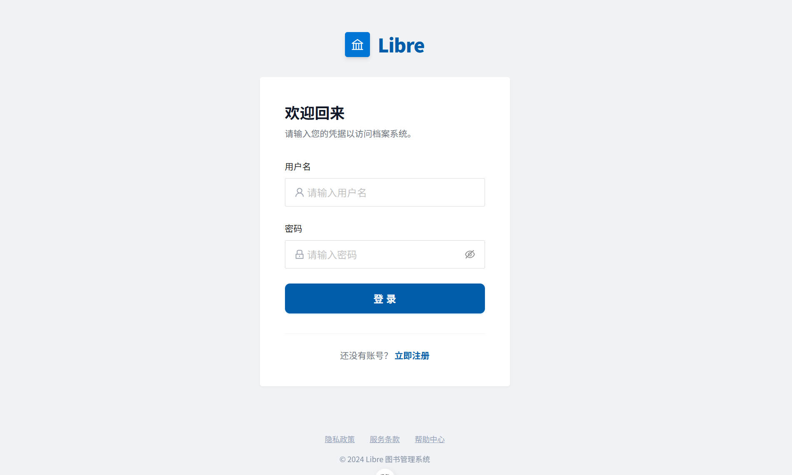

**注册**

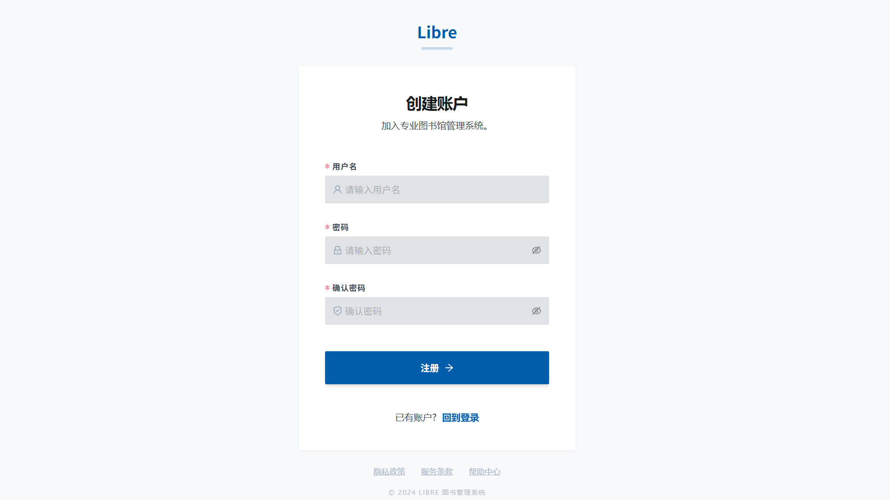

### 首页

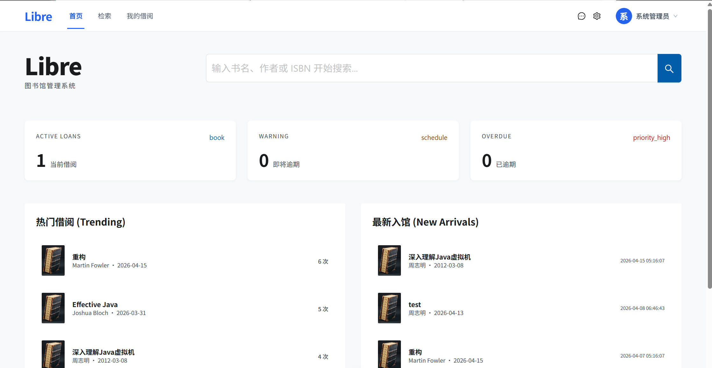

### 图书检索与列表

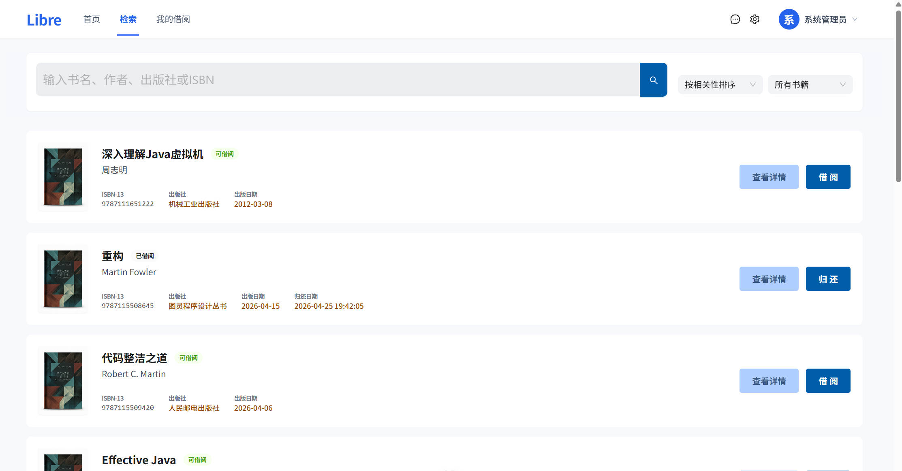

### 图书详情

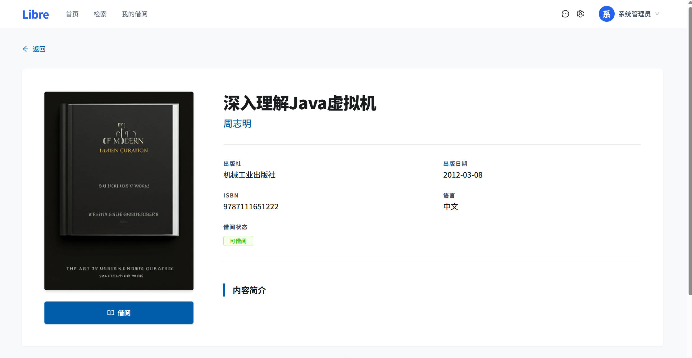

### 我的借阅

**我的借阅**

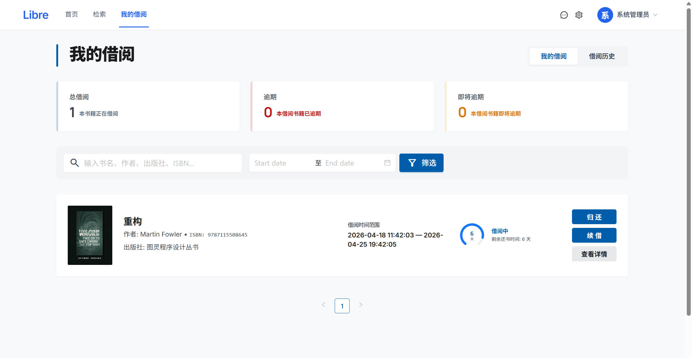

**借阅历史**

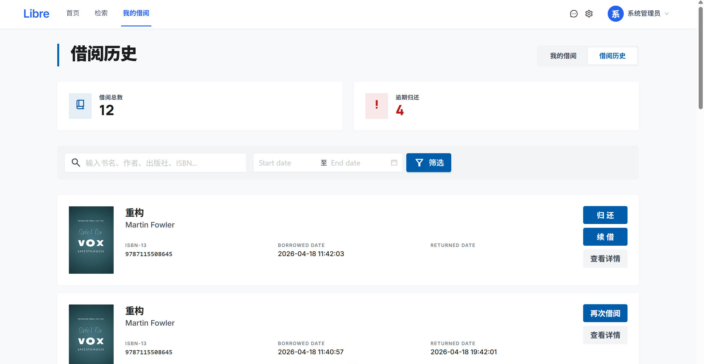

### 个人中心

**个人信息**

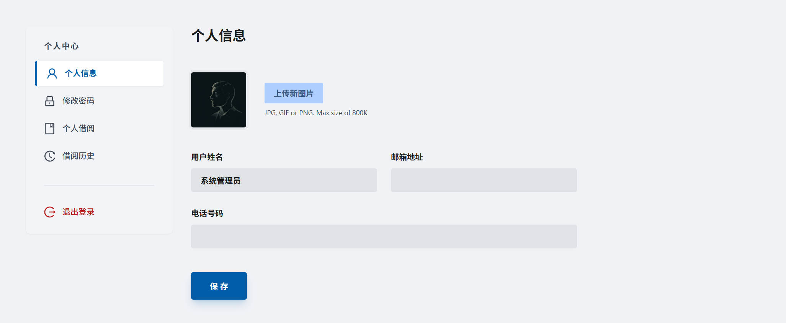

**修改密码**

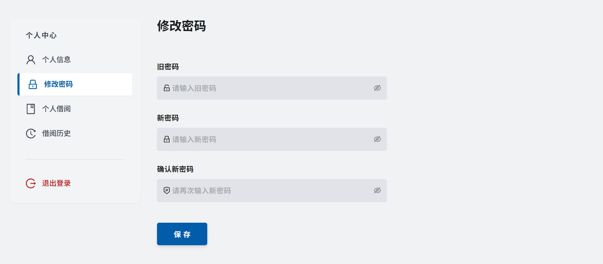

**个人借阅**

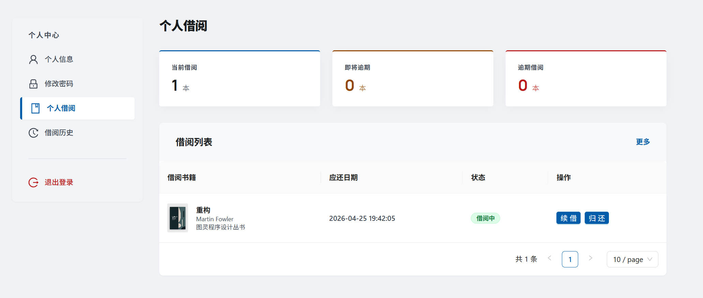

**借阅历史**

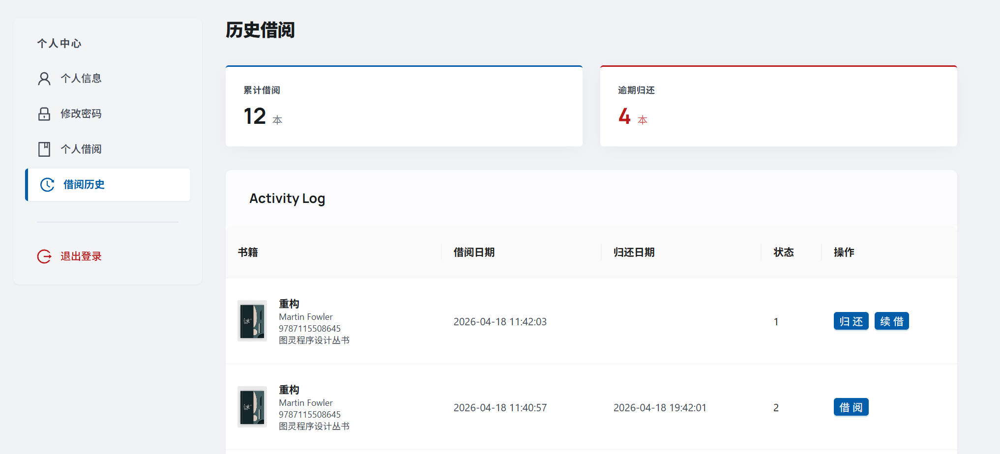
